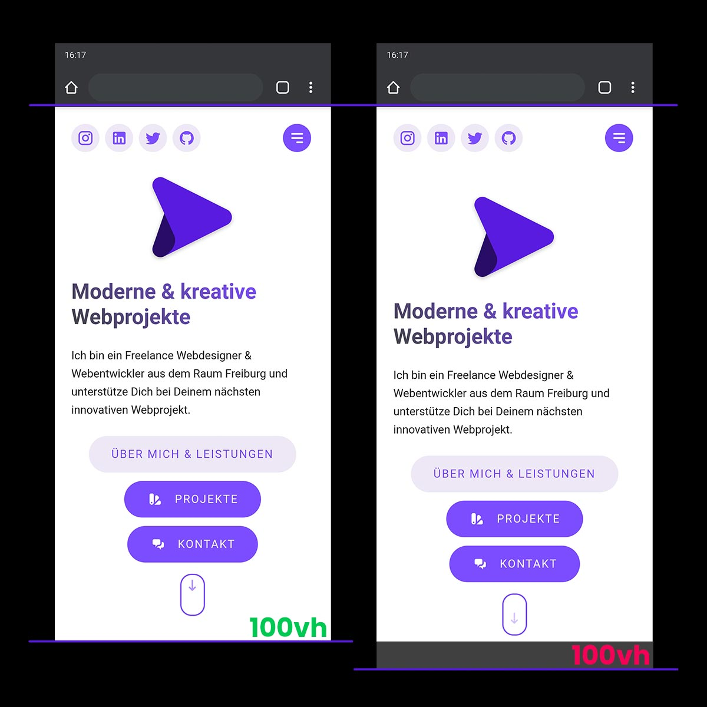

This Plugin solves the URL Bar Resizing issue with viewport units on mobile devices. [Read here](https://developers.google.com/web/updates/2016/12/url-bar-resizing).



# Navigation
- [Navigation](#navigation)
  - [Installation](#installation)
  - [Registration](#registration)
    - [Vue.js](#vuejs)
    - [Nuxt.js](#nuxtjs)
  - [Usage](#usage)
  - [Fallback](#fallback)

## Installation

``` bash
npm install vue-responsive-vh
```

## Registration

### Vue.js

Go to your ``main.js`` and use the Plugin as follows:

``` javascript
// ./src/main.js

import Vue from 'vue'
import VueResponsiveVh from 'vue-responsive-vh'
import 'vue-responsive-vh/dist/vue-responsive-vh.css'

Vue.use(VueResponsiveVh)
```

Registration complete ✨.

### Nuxt.js

For Nuxt.js we will create a simple Plugin.
First create a file named ``vue-responsive-vh.js`` in your ``~/plugins`` folder.
Then register the Plugin as follows:

``` javascript
// ~/plugins/vue-responsive-vh.js

import Vue from 'vue'
import VueResponsiveVh from 'vue-responsive-vh'
import 'vue-responsive-vh/dist/vue-responsive-vh.css'

Vue.use(VueResponsiveVh)
```

Then add the Plugin into the `plugins: []` Array in your Nuxt.js configuration file ``nuxt.config.js``

``` javascript
// ~/nuxt.config.js 

export default {

  plugins: [
    '~/plugins/vue-responsive-vh.js'
  ],

}
```

Registration complete ✨.

## Usage

You can choose between two Directives:

| Directive          | Description                                    | Changed CSS Property |
| :----------------- | :--------------------------------------------- | :------------------- |
| ``v-min-h-screen`` | Min height of the element is screen height.    | ``min-height``       |
| ``v-h-screen``     | Fixed height of the element is screen height.  | ``height``           |

Add the Directive you need to any element you choose to give it a responsive ``vh``, which depends on the appearance of the URL Bar.

``` jsx
// YourComponent.vue

<template>
  <div v-min-h-screen>
    ...
  </div>
</template>
```

``` jsx
// YourComponent.vue

<template>
  <div v-h-screen>
    ...
  </div>
</template>
```

## Fallback

If there is an issue with the calculation or missing Browser Support, the default Fallback is `100vh`.
